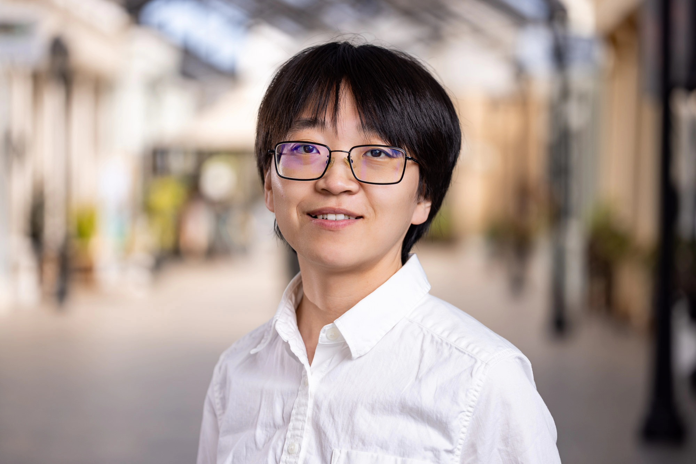

# About me

I am a Lise-Meitner Research Group Leader in the APEx department at the Max Planck Institute for Astronomy in Heidelberg, Germany.
My research focuses on observational charcaterization of exoplanet atmospheres, with particular interests in utilising high-resolution spectroscopy to probe atmospheric properties of exoplanets, including chemical and isotopic composition, atmospheric structure and dynamics, to unravel planet formation and evolution history.

<!-- My research features the first detection of minor isotopologue in the atmosphere of an exoplanet and brown dwarf, see [Zhang et al. 2021a (Nature)](https://ui.adsabs.harvard.edu/abs/2021Natur.595..370Z/abstract) and [Zhang et al. 2021b (A&A)](https://ui.adsabs.harvard.edu/abs/2021A%26A...656A..76Z/abstract). -->

# Contact

**Email**: yazhang@mpia.de

**Address**: \
&nbsp;&nbsp;&nbsp;&nbsp;Königstuhl 17, 69117 Heidelberg, Germany
<!-- &nbsp;&nbsp;&nbsp;&nbsp;California Institute of Technology \
&nbsp;&nbsp;&nbsp;&nbsp;1200 E. California Blvd., MC 249-17 \
&nbsp;&nbsp;&nbsp;&nbsp;Pasadena, CA 91125 -->

