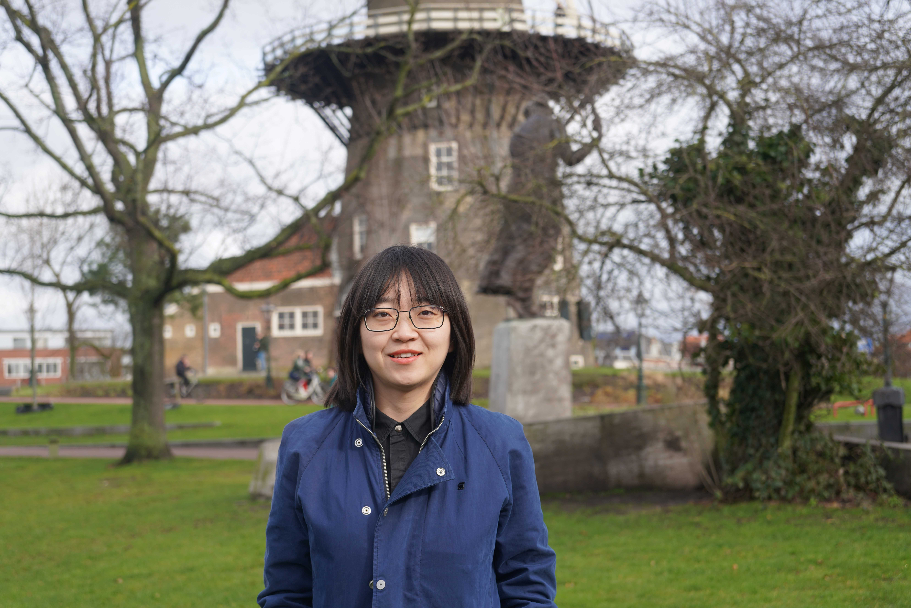

# About me

I am a postdoctoral researcher at California institute of technology funded by the 51 Pegasi b fellowship from Heising-Simons Foundation. I obtained my PhD degree at Leiden University in 2023, working on the characterization of **exoplanet atmospheres** under the supervision of Prof. [Ignas Snellen](https://home.strw.leidenuniv.nl/~snellen/). Prior to that, I did my undergraduate study in astronomy at Nanjing University in China. 

My research explores various topics of exoplanet atmospheres, circumstellar disks and planet formation, with particular interests in utilising high-resolution spectroscopy to probe atmospheric properties of exoplanets, such as chemical and isotopic composition, and atmospheric escape, which bear valuable information of planet formation and evolution history.

My research features the first detection of minor isotopologue in the atmosphere of an exoplanet and brown dwarf, see [Zhang et al. 2021a (Nature)](https://ui.adsabs.harvard.edu/abs/2021Natur.595..370Z/abstract) and [Zhang et al. 2021b (A&A)](https://ui.adsabs.harvard.edu/abs/2021A%26A...656A..76Z/abstract).

