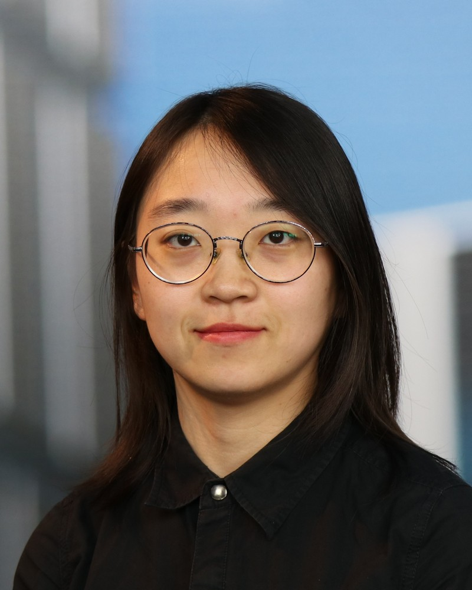

I am a PhD candidate at Leiden Observatory, working on characterisations of **exoplanet atmospheres** under the supervision of Prof. [Ignas Snellen](https://home.strw.leidenuniv.nl/~snellen/). I obtained my Master's degree in Astronomy and Data Science at Leiden University. Prior to that, I studied astronomy at Nanjing University in China. 

My research explores various topics of exoplanet atmospheres, circumstellar disks and planet formation, with particular interests in utilising high-dispersion spectroscopy to probe atmospheric properties of exoplanets, such as chemical and isotopic abudances, rotation, and atmospheric escape, which bear valuable information of planet formation and evolution history.

